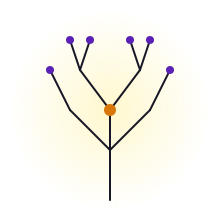

<Cover
  title="The <em>Ultimate</em> Rational Meme"
  sub="On the meme that lets every other rational meme evolve."
  author="Paul Razvan Berg"
  event="Conjecture Con Europe"
  date="2026"
/>

<!--
Opener. The Ultimate Rational Meme — a name I'm proposing for a universal cultural memeplex. I'll spend ten minutes convincing you it's a useful concept. Then we'll have five minutes for you to try to refute it, which is on-brand for this crowd. 🧠
-->

---
layout: two-cols
layoutClass: gap-12 px-14
---

Who is this guy

# Hello, Crit Rats 👋

  👔 Tech Founder @ Sablier Labs
  👨‍💻 Software engineer for 11+ years
  📖 Studying David's work for 4+ years, as a hobby
  ✍️ Working on a paper this talk is based on

::right::

  
Today's claim

  

    There is a <strong>universal cultural memeplex</strong> that — once instantiated — enables the open-ended evolution of <em>every other</em> rational meme.
  

  
Naming it

  

    I'll call it the <strong>Ultimate Rational Meme</strong> — the <strong>URM</strong> for short.
  

<!--
The bio is brief on purpose. The two callouts are the whole talk in 30 seconds — if you walk out now, you've still got the thesis.
-->

---
layout: default
---

Agenda · 10 min · then 5 min Q&A

# What we'll cover

<ol class="toc-list">
  <li>
Not all memes are created <em>equal</em>
</li>
  <li>
The Ultimate Rational Meme: <em>defined</em>
</li>
  <li>
The Enlightenment as our best real-world approximation
</li>
  <li>
...and what this means for <em>physics</em>
</li>
</ol>

<!--
Quick frame-setter. Critical rationalists like Deutsch, Popper. I'll connect memetics → epistemology → political philosophy → physics. Four jumps, ten minutes. Buckle in.
-->

---

<SectionDivider
  number="01"
  eyebrow="Memes 101"
  title="Not all memes are created equal"
  kicker="Dawkins gave us memes. Deutsch distinguished between knowledge-creating and knowledge-destroying memes."
/>

---
layout: default
---

A 60-second history

# Two thinkers, one ladder 🧬 → 🧠

<Concept label="1976 · The Selfish Gene" title="Dawkins coins the meme." emoji="🧬">

- Memes are **units of cultural transmission**.
- They replicate, vary, get selected — like genes.
- Success ≠ goodness. A catchy meme is just _successful_.

</Concept>

<Concept label="2011 · Beginning of Infinity" title="Deutsch splits the meme tree." emoji="🧠">

- Some memes are **knowledge-creating**.
- Cultural evolution isn't blind — it runs on **conjecture &amp; criticism**.
- A meme that survives Popperian refutation is a different _kind_ of thing.

</Concept>

<!--
Dawkins gave us replication. Deutsch gave us purpose. The bridge from "memes spread" to "memes can carry knowledge" is the move that makes today's talk possible.
-->

---
layout: default
---

Mode of replication · the bifurcation

# Two ways a meme can stick

<DrakeMeme
  rejectEmoji="🛑"
  reject="Anti-rational memes — replicate by disabling rationality."
  rejectSub="Resist criticism. Suppress knowledge growth. Lean on coercion, taboo, authority, or fear. e.g. cults of personality, religious zealotry, ultra-conservatism."
  approveEmoji="✨"
  approve="Rational memes — replicate by being useful."
  approveSub="Invite criticism. Promote knowledge growth. Evolve through creativity and error correction. e.g. Newton's laws, evolution, the scientific method, classical liberalism."
/>

<!--
The Drake meme but ~scholarly~. This split is doing the heavy lifting in the rest of the talk. Anti-rational memes win the short game, rational memes win the long game — *if* we let them.
-->

---

<SectionDivider
  number="02"
  eyebrow="The Ultimate Rational Meme"
  title="The Ultimate Rational Meme: defined"
  kicker="If you can find a meme that lets every other rational meme evolve, you've found the cultural analogue of a universal computer."
/>

---
layout: default
---

Definition

# The Ultimate Rational Meme

A universal cultural memeplex that, once instantiated, enables the <strong>open-ended evolution</strong> of <em>every other</em> rational meme — through criticism, error correction, and the rejection of anti-rational ideas.

  🔄 a Kantian regulative idea — never fully attained
  🌍 universal — aliens &amp; AGIs included
  🛡 anti-anti-rational by logical necessity

<GhibliFrame
  src="./assets/ghibli-galileo.svg"
  alt="Ghibli-style: a child at the edge of a forest of branching ideas, holding a small lantern of curiosity."
  caption="🎨 placeholder — to be regenerated"
  ratio="3/4"
/>

<!--
This is the central definition. Three things matter:
1. It's regulative — we aim, never arrive.
2. It's universal — aliens and AGIs need it too.
3. It's anti-anti-rational — the only memes it rejects are memes that block other memes from existing.
-->

---
layout: default
---

Anticipated objection

# Wait — isn't this just dogma? 🤔

A fair Popperian first reaction: <em>"You're asserting a universal meme — sounds dogmatic."</em>

That's exactly why I'm making a <strong>bold claim</strong>. In Popper's terms, a conjecture has to be <strong>specific</strong> and <strong>universal</strong> to be bold at all.

<Quote author="Karl Popper" source="Logic of Scientific Discovery, 1959">
Bold ideas, unjustified anticipations, and speculative thought, are our only means for interpreting nature.
</Quote>

  
What the URM actually claims

  

    Not <em>"this idea is the truth"</em>. Just: <strong>for any non-URM rational meme to proliferate, URM itself must prevail</strong>.
  

  

    A single, falsifiable, meta-level proposition — fully compatible with Popperian fallibilism. ✅
  

  
Kantian regulative idea 🧭

  

    Not a destination — an orienting <em>horizon</em>. We never fully instantiate the URM, but every move toward openness, criticism, and error-correction is a move <em>toward</em> it.
  

<!--
The objection any Popperian will raise: "claiming a 'universal' meme sounds dogmatic". Lean into it. Popper himself demanded conjectures be specific and universal — that's what makes them *bold*. And the URM isn't claiming to be true a priori; it's claiming a precondition: for any non-URM rational meme to proliferate, URM-like structures must prevail. A single, falsifiable meta-claim. As a Kantian regulative idea, it works as a horizon — we never arrive, but inquiry organises itself around it.
-->

---
layout: default
---

The URM's only red line

# Anti-anti-rational 🛡

  Tolerate every rational meme. Cancel only the cancellers.

  
The derivation

  
premise URM enables <em>all</em> rational memes

  
∴ rejects only what <em>blocks</em> them

  
∴ <strong>anti-anti-rational</strong>

  
Co-existence is the realistic mode

  

    The URM and anti-rational memes <strong>coexist in society</strong>.
  

  

    But where the URM operates explicitly — <em>science, courts, peer review, markets</em> — they're operationally immiscible.
  

<!--
Anti-anti-rational: the URM tolerates everything that tolerates back. It rejects only the rejecters — the memes whose mode of replication is the suppression of other memes.

This is the key move. The URM doesn't demand a perfectly rational society — that's never existed and never will. It demands *protected zones* where the rules of error correction apply: science, courts, peer review, markets at their best. Inside those zones, anti-rational memes can't operate. Outside, anything goes. Co-existence is the realistic mode; operational immiscibility is the load-bearing constraint — like oil and water, same vessel, never mixing where it counts.
-->

---

<SectionDivider
  number="03"
  eyebrow="The Enlightenment"
  title="The Enlightenment as our best real-world approximation"
  kicker="Beyond theory, the political establishment of the Enlightenment is the URM's best embodied form."
/>

---
layout: default
---

Compounding interest, applied to civilisation

# The last 500 years — a statistical anomaly 🚀

  

    
🏛

    
~500 BC — ~500 AD

    
Athens, briefly. Then Rome. Critical thinking flickers on and off.

  

  

    
🕯

    
~500 — ~1500

    
Knowledge as transmission, not creation. Anti-rational memes dominant.

  

  

    
💡

    
~1685 — present

    
The Enlightenment. Criticism institutionalised. <em>Compounding begins.</em>

  

  

    
Deutsch's observation

    
≈ 500 years

    
describes the last 500. Describing prior history takes about as much.

  

  

    
Childhood mortality, 1800

    
~46%

    
today: ~4%. The compounding is not subtle.

  

<!--
The Enlightenment didn't just give us steam engines — it gave us the *protocol* for getting all the things after the steam engine. Institutionalised criticism = compounding knowledge. That's it. That's the whole trick.
-->

---
layout: default
---

Popper's paradox — dissolved

# The Paradox of Tolerance ⚖️

<Quote author="Karl Popper" source="The Open Society and Its Enemies, 1945">
Unlimited tolerance, if extended to those who are intolerant, can lead to the destruction of tolerance itself.
</Quote>

Through the URM lens, this is not a paradox — it's an <em>identity</em>. The intolerant want to <strong>replace the URM</strong> with an anti-rational meme (Popper's lifetime: Nazi fascism). Refusing that is <strong>rational self-preservation</strong>, not hypocrisy.

  
step 1 URM enables every rational meme

  
step 2 anti-rational memes <em>destroy</em> the URM

  
∴ rejecting them is what the URM <em>does</em>

  
corollary "tolerance of intolerance" was a category error

  
Same trick, second paradox

  

    The ideal culture: <strong>everything is open to change</strong> — <em>except</em> the culture that allows for such open-mindedness.
  

<!--
Two political-philosophy paradoxes for the price of one. The URM dissolves both because it draws the bright line at "memes that destroy the means of error correction". Everything else is fair game.
-->

---
layout: default
class: no-footer
---

  

  

    <svg viewBox="0 0 96 96" width="84" height="84">
      <g stroke="#5b21b6" stroke-width="1.4" stroke-linecap="round" fill="none" opacity="0.92">
        <line x1="48" y1="6"  x2="48" y2="20"/>
        <line x1="48" y1="76" x2="48" y2="90"/>
        <line x1="6"  y1="48" x2="20" y2="48"/>
        <line x1="76" y1="48" x2="90" y2="48"/>
        <line x1="18" y1="18" x2="28" y2="28"/>
        <line x1="68" y1="68" x2="78" y2="78"/>
        <line x1="78" y1="18" x2="68" y2="28"/>
        <line x1="28" y1="68" x2="18" y2="78"/>
      </g>
      <circle cx="48" cy="48" r="15" fill="none" stroke="#5b21b6" stroke-width="1" opacity="0.45"/>
      <circle cx="48" cy="48" r="8" fill="#d97706"/>
    </svg>
  

  <h1 class="manifesto-title">
    Advocating for the <em>Enlightenment</em> 
    is not a political stance.
  </h1>

  

    
    ✦
    
  

  

    It's the precondition for having political stances at all.
  

<!--
The substrate slide. Defending the Enlightenment is upstream of any political position — it's the ground on which political positions can exist. Refusing to defend it is the only stance the URM rules out.
-->

---

<SectionDivider
  number="04"
  eyebrow="Physical Lens"
  title="...and what this means for physics"
  kicker="If the URM is true, it has consequences for physics."
/>

---
layout: default
---

Knowledge resists the multiverse

# Abstract multiversal crystals 💎

In Everettian quantum theory, branches normally diverge.

But the URM accelerates <em>hard-to-vary</em> memes.

Branches that split long ago <strong>converge ideologically</strong> as they make the same discoveries.

  
The idea

  
<strong>Knowledge transcends decoherence.</strong> Truth is a <em>multiversal attractor</em>.

<GhibliFrame
  src="./assets/ghibli-crystals.svg"
  alt="Ghibli-style: crystalline knowledge structures growing across parallel branches of reality, all converging on the same shape."
  caption="🎨 placeholder — to be regenerated"
  ratio="3/4"
/>

<!--
The most speculative slide and my favourite. If knowledge is hard-to-vary information, and the URM is the meme that accelerates the discovery of hard-to-vary truths, then societies that adopt the URM literally start to look alike across the multiverse — not because they copied each other, but because they're all converging on the same laws of physics.
-->

---
layout: default
class: no-footer
---

Thank you 🙏

<h1 style="font-family: var(--font-serif); font-size: 6rem; letter-spacing: -0.04em; margin: 0; line-height: 0.95; font-weight: 700;">
  Questions?
</h1>

  Spread the URM by sharing this talk.

  <strong style="color: var(--c-ink); font-weight: 600;">Paul Razvan Berg</strong>
  &nbsp;·&nbsp;  PaulRBerg

  

    
  

  
🌱 the URM, branching

<!--
End slide. Q&A. The "now refute me" line should land — this crowd will appreciate it. The visual is the same emblem from the cover — a recursive idea tree, our talk's visual through-line.
-->
