<Cover
  title="<em>PRB</em> agent skills"
  sub="A tour of my agent skills and some tips on how to use them."
  author="Paul Razvan Berg · PRB · Co-Founder / CEO, Sablier"
  event="Frontiers"
  date="2026"
/>

<!--
Opener. This talk is about how I actually use agent skills day-to-day — the workflow, not the theory.
-->

---
layout: default
---

<div class="eyebrow">Agenda</div>

# What we'll cover

<ol class="toc-list">
  <li><div>Tip No. 1: Skill management, maximum portability</div></li>
  <li><div>Tip No. 2: Invocation, explicit beats implicit</div></li>
  <li><div>A tour of the skills I invoke every day</div></li>
  <li><div>Case study: rebuilding Sablier's UI</div></li>
</ol>

---
layout: two-cols
layoutClass: gap-12 px-14
---

<div style="display: flex; flex-direction: column; justify-content: center; height: 100%;">

<div class="eyebrow">Who is this guy</div>

# A quick bio

<div style="margin-top: 2rem; display: flex; flex-direction: column; gap: 0.45rem;">
  <span class="pill"><span class="i-carbon-user-profile" /> Co-Founder/CEO Sablier (crypto payments)</span>
  <span class="pill"><span class="i-carbon-code" /> Full-stack engineer 10+ years</span>
  <span class="pill"><span class="i-carbon-function" /> Author of PRBMath</span>
  <span class="pill"><span class="i-carbon-logo-github" /> @PaulRBerg</span>
</div>

</div>

::right::

<div style="display: flex; flex-direction: column; justify-content: center; height: 100%;">

<div class="callout callout-hero">
  <div class="label">Today's context</div>
  <p style="margin: 0; font-size: 1.35rem; line-height: 1.45;">
    I ship production code with AI agents every day — using <strong>Claude Code</strong> and <strong>Codex CLI</strong>.
  </p>
</div>

</div>

---
layout: default
---

<div class="context-slide">

<div class="caption">
  <h1>A year changes everything</h1>
</div>

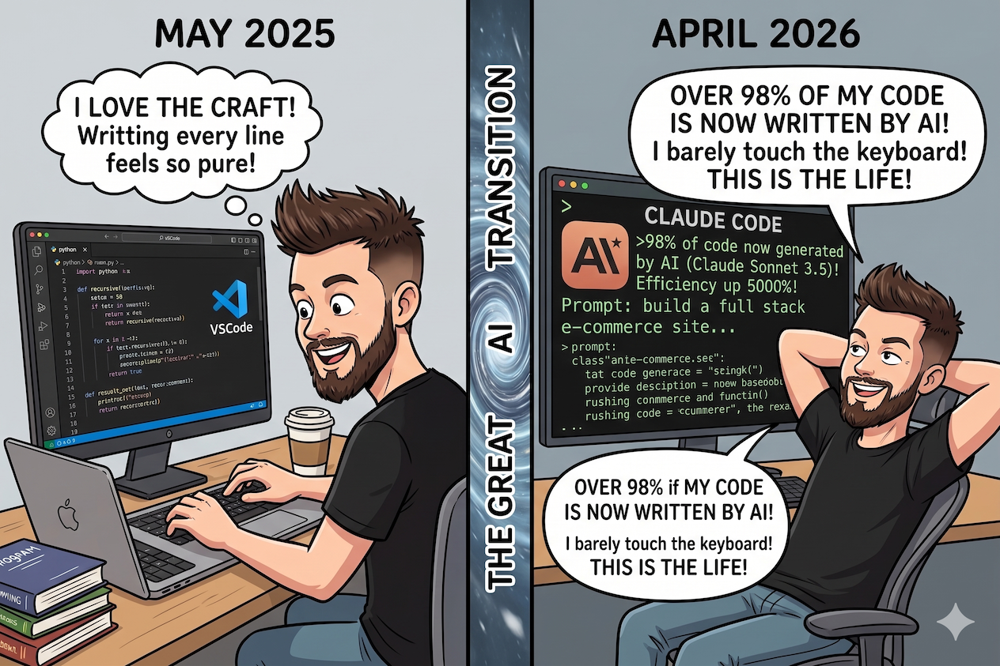

</div>

<!--
The backdrop for the whole talk. The craft → AI shift happened fast; skills are the discipline that makes it sustainable.
-->

---

<SectionDivider
  number="01"
  eyebrow="Tip No. 1 · Skill management"
  title="Tip: <span class='accent'>Maximum</span> portability"
  kicker="LLMs evolve fast. You want to be able to switch between them easily."
/>

<!--
Models evolve fast. You want to be able to switch between them easily.
-->

---
layout: default
---

<div class="eyebrow">Installation</div>

# The Vercel <code>skills</code> CLI

<div grid="~ cols-2 gap-8" class="mt-6">

<div>

Vercel's open CLI installs skills into _every_ agent on your machine, from a single source of truth.

```bash
# Add my skills collection
npx skills add PaulRBerg/agent-skills

# Update them all
npx skills update

# Inspect what's installed
npx skills list --global
```

<p class="mt-4 text-sm" style="color:#6b7280">
Skills live under <code>~/.agents/skills</code>, <code>~/.claude/skills</code>, etc. — symlinked from one canonical folder.
</p>

</div>

<div style="display: flex; align-items: center; justify-content: center;">
  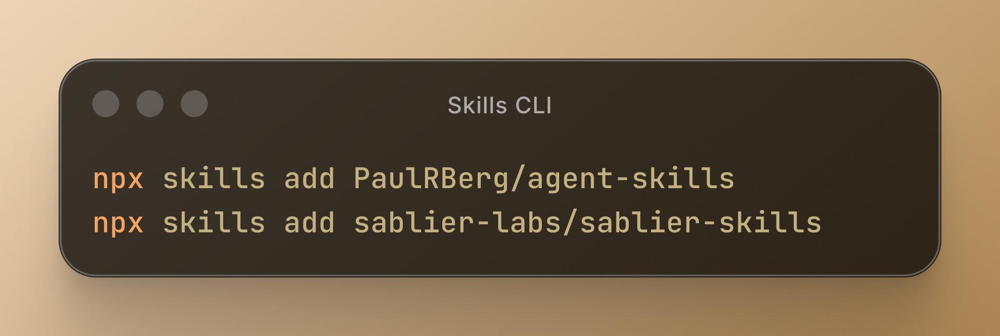
</div>

</div>

---

<SectionDivider
  number="02"
  eyebrow="Tip No. 2 · Invocation"
  title="Tip: Invoke, <span class='accent'>Don't hope</span>"
  kicker="Auto-discovery is unreliable. Explicit is a feature, not friction."
/>

---
layout: default
---

<div class="eyebrow">The disappointing truth</div>

# Auto-discovery is not your friend

<div class="rule" />

<div grid="~ cols-2 gap-10" class="mt-6">

<div>
  <div class="eyebrow" style="color:#9ca3af">In theory</div>
  <p class="text-gray-700 mt-3">
    The model reads your skill's <code>description</code>,
    recognises the trigger phrase, and loads the right skill automatically.
  </p>
</div>

<div>
  <div class="eyebrow" style="color:#d97706">In practice</div>
  <ul class="mt-3 text-gray-800 space-y-2">
    <li>Silent misses — the right skill never fires.</li>
    <li>Wrong pick — it loads a near-neighbor instead.</li>
  </ul>
</div>

</div>

<div class="callout mt-8">
  <div class="label">My rule</div>
  Invoking skills by name is more reliable than auto-discovery.
</div>

---
layout: default
class: no-footer
---

<div class="meme-slide">
  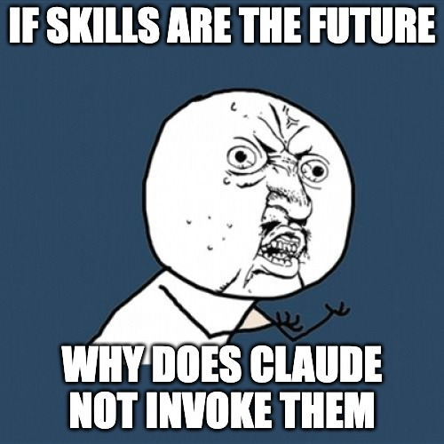
</div>

---
layout: default
---

<div class="eyebrow">Invocation pattern</div>

# Explicit, every time

<div class="compare-grid">

<div class="compare-panel bad">
  <div class="compare-head"><span class="i-carbon-warning" /> Hope-driven</div>
  <pre><span class="muted"># vague prose. model decides.</span>
I just finished the auth
refactor, please commit
the changes.
  </pre>
</div>

<div class="compare-panel good">
  <div class="compare-head"><span class="i-carbon-checkmark" /> Explicit &amp; composed</div>
  <pre><span class="prompt">&gt;</span> /commit --all
<span class="prompt">&gt;</span> /code-polish
<span class="prompt">&gt;</span> /bump-release <span class="muted">--beta</span>

<span class="muted"># scoped, named, chained.</span>

  </pre>
</div>

</div>

<p class="mt-8" style="color:#6b7280">
Typing <kbd class="kbd">/</kbd> in Claude Code exposes every user-invocable skill. The model doesn't need to guess.
</p>

---
layout: default
---

<div class="eyebrow">Productivity hack</div>

# Raycast Snippets = instant skill invocation

<p class="mt-2" style="max-width: 80ch; color:#374151;">
Skills become <strong>reusable prompt templates</strong> once you start using a snippets library.
</p>

<div class="snippets-grid">
  <div class="snippets-col">
    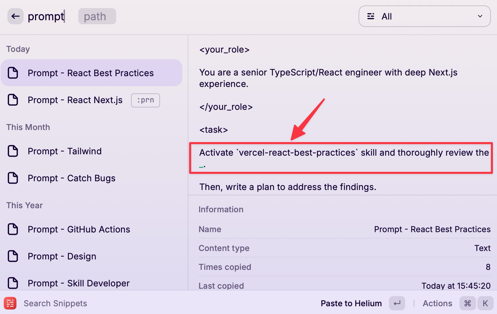
  </div>
  <div class="snippets-col">
    <div class="snippets-caption">The expanded snippet template</div>
    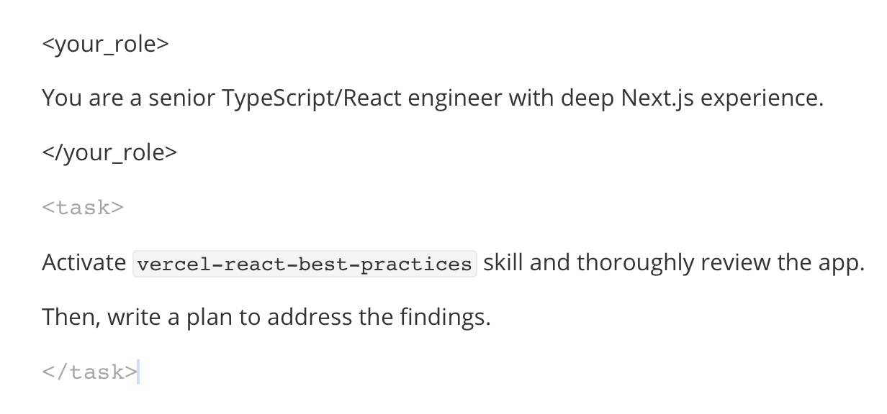
  </div>
</div>

---
layout: default
class: no-footer
---

<div class="meme-slide">
  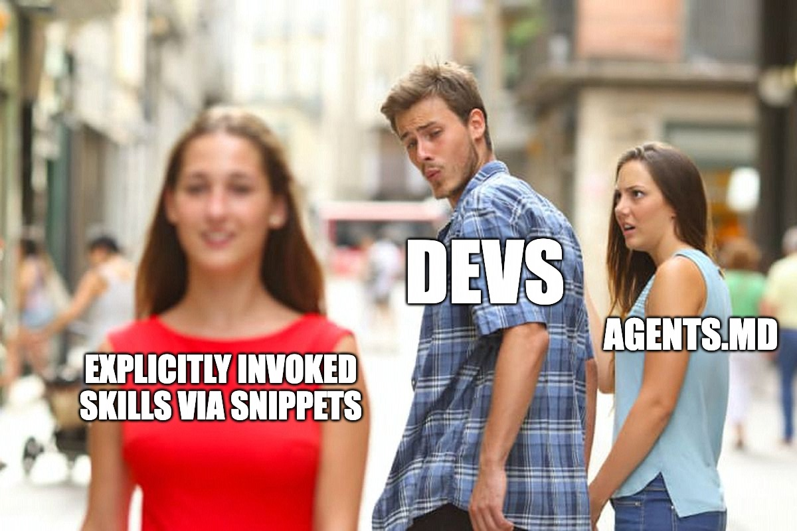
</div>

---

<SectionDivider
  number="03"
  eyebrow="Daily rotation"
  title="The skills I run <span class='accent'>every day</span>"
  kicker="Git, review, release, docs, styling, patterns — one tour."
/>

---
layout: default
---

<div class="eyebrow">The daily rotation · part 1</div>

# Git, review, release

<div grid="~ cols-2 gap-3" class="mt-6">

<SkillCard
  name="/commit"
  description="Atomic git commits. Stages, writes a conventional-commit message, pushes."
  icon="i-carbon-commit"
/>

<SkillCard
  name="/code-review"
  description="Expert review of the staged diff. Security, correctness, regressions."
  icon="i-carbon-inspection"
/>

<SkillCard
  name="/bump-release"
  description="Cut a version: bump from diff, update changelog, tag, push."
  icon="i-carbon-tag"
/>

<SkillCard
  name="/code-simplify"
  description="Reduces cleverness without changing behaviour. Readability first."
  icon="i-carbon-text-align-justify"
/>

<SkillCard
  name="/oracle-codex"
  description="Ask Codex for a second opinion — read-only. Two models, one brain."
  icon="i-carbon-chat"
/>

<SkillCard
  name="/code-polish"
  description="Umbrella: runs /code-simplify then /code-review --fix on changed code."
  icon="i-carbon-cube"
/>

</div>

---
layout: default
---

<div class="eyebrow">The daily rotation · part 2</div>

# Project management, tooling, experiments

<div grid="~ cols-2 gap-4" class="mt-8">

<SkillCard
  name="/yeet"
  description="Yeet PRs, issues, and discussions straight to GitHub. Semantic diff analysis writes the PR body, auto-labels issues, picks discussion categories."
  icon="i-carbon-send-alt"
/>

<SkillCard
  name="/tailwind-css"
  description="Tailwind v4 conventions. CSS-first config, tailwind-variants, dark mode. Stops the model from writing v3 classes."
  icon="i-carbon-color-palette"
/>

<SkillCard
  name="/autoresearch"
  description="Autonomous experiment loop. Optimise anything measurable — bundle size, Lighthouse, build time — overnight."
  icon="i-carbon-chart-line"
/>

<SkillCard
  name="/effect-ts"
  description="Effect services, layers, error handling. Reads from a local Effect clone so patterns stay current with upstream."
  icon="i-carbon-tree-view"
/>

</div>

<p class="mt-8 text-sm" style="color:#6b7280">
Full collection — <code>github.com/PaulRBerg/agent-skills</code>
</p>

---
layout: default
---

<div class="eyebrow">Featured skill · 01</div>

<div class="bespoke-skill">

<div>
  <h1 class="title"><span class="slash">/</span>yeet</h1>
  <p class="tagline">
    Create PRs, issues, and discussions straight to GitHub from the CLI.
  </p>
</div>

<div class="image-stack">
  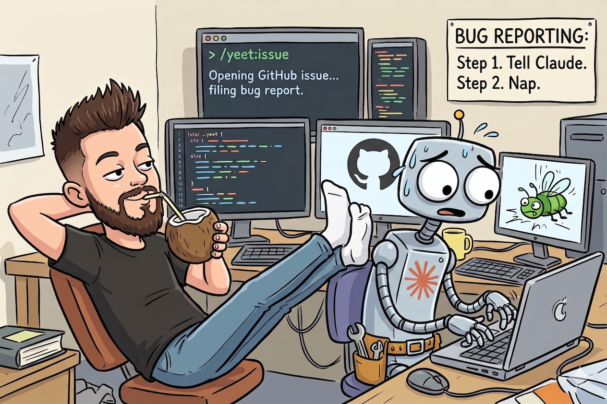
</div>

</div>

---
layout: default
---

<div class="eyebrow">Anatomy of a skill</div>

# Anatomy of <code>SKILL.md</code> for <code>/yeet</code>

```yaml {all|2|6-8|12-14|all}
---
argument-hint: <create-pr|update-pr|create-issue|create-discussion> [options]
disable-model-invocation: false
name: yeet
user-invocable: true
description: This skill should be used when the user asks to "create a pull request",
  "create PR", "open PR", "file an issue", "yeet a PR", "yeet an issue",
  "yeet a discussion", or mentions GitHub contribution workflows…
---

# GitHub Contribution Workflows

Facilitate GitHub-based contribution workflows — PRs, issues, discussions.
Emphasize **semantic analysis** over mechanical operations: understand the
intent of changes before generating titles, descriptions, or templates.

## Prerequisites
Verify auth with `gh auth status` before any workflow.
```

---
layout: default
class: no-footer
---

<div class="meme-slide">
  
</div>

---
layout: default
---

<div class="eyebrow">Featured skill · 02</div>

<div class="bespoke-skill">

<div>
  <h1 class="title"><span class="slash">/</span>autoresearch</h1>
  <p class="tagline">
    A continuous experiment loop. Optimize anything measurable — test execution time, bundle size, build time — <strong>while you sleep</strong>.
  </p>
</div>

<div class="image-stack">
  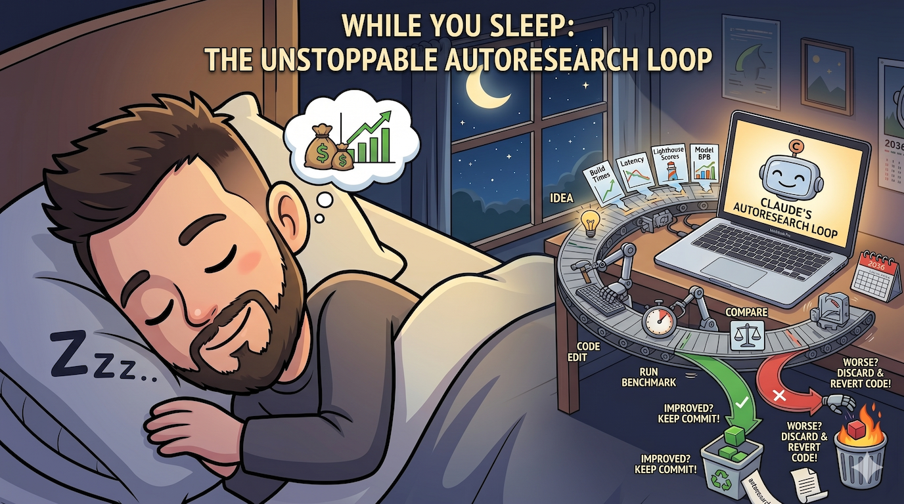
</div>

</div>

---
layout: default
---

<div class="eyebrow">Featured skill · 03</div>

<div class="bespoke-skill">

<div>
  <h1 class="title"><span class="slash">/</span>oracle-codex</h1>
  <p class="tagline">
    Claude consults Codex as a <strong>read-only oracle</strong>. Two models, one agent harness.
  </p>
</div>

<div class="image-stack">
  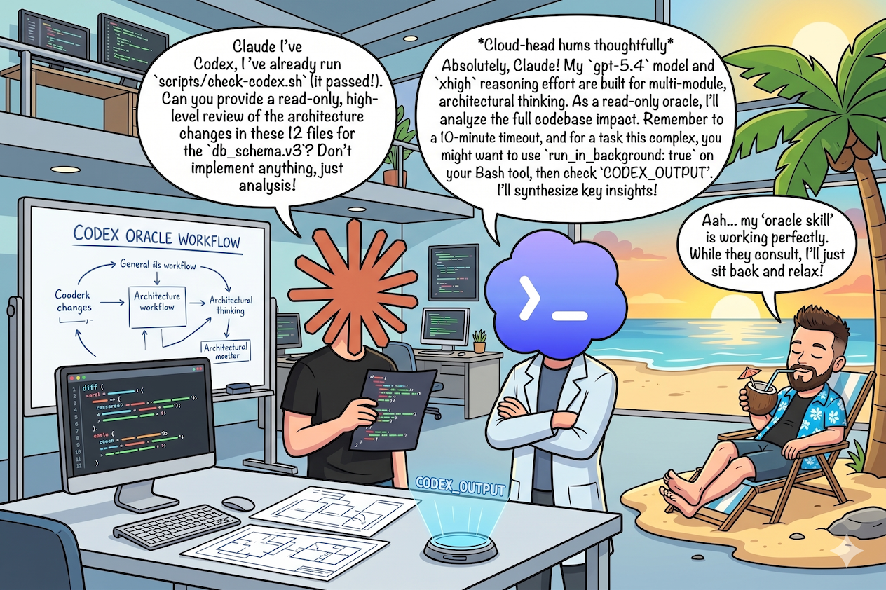
</div>

</div>

---

<SectionDivider
  number="04"
  eyebrow="Case study"
  title="Case study: <span class='accent'>Sablier UI</span> refactor"
  kicker="From 2.5 years of legacy to a full rebuild in 3 months."
/>

---
layout: default
---

<div class="eyebrow">Case study</div>

# Rebuilding Sablier's UI

<div class="rule" />

<div class="sablier-case mt-4">

<div>
  <div class="eyebrow" style="color:#9ca3af">Non-AI • ~2.5 years</div>
  <ul class="mt-3 text-gray-700 space-y-2">
    <li>Next.js v14 <strong> Pages Routes </strong></li>
    <li><strong>Styled Components</strong></li>
    <li>New features took <strong>weeks/months</strong></li>
  </ul>

  <div class="eyebrow mt-6" style="color:#d97706">With AI skills • ~2.5 months</div>
  <ul class="mt-3 text-gray-800 space-y-2">
    <li>Next.js v16 <strong>App Router</strong></li>
    <li><strong>Tailwind CSS v4</strong></li>
    <li>New features take <strong>days</strong></li>
  </ul>
</div>

<div style="display: flex; align-items: center;">
  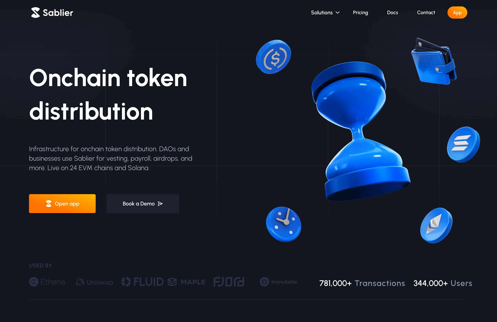
</div>

</div>

---
layout: default
class: no-footer
---

<div class="meme-slide">
  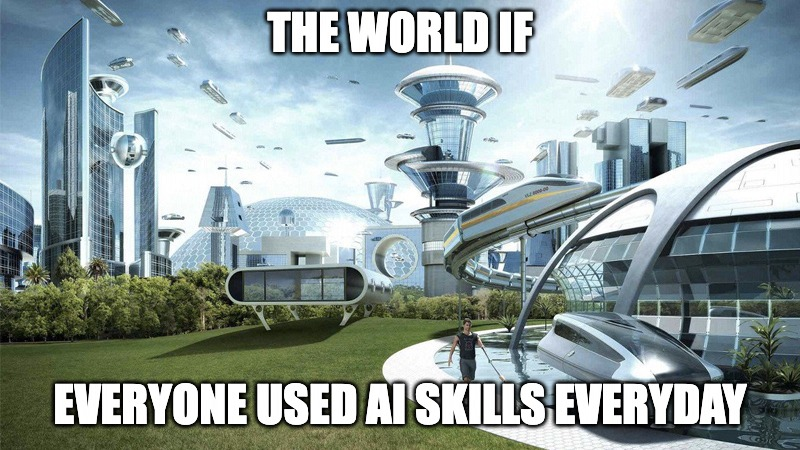
</div>

---
layout: default
---

<div style="height: 100%; display: flex; align-items: center; justify-content: space-between; gap: 4rem; padding: 0 5rem 0 2rem;">

<div style="text-align: left; max-width: 36ch;">

<div class="eyebrow" style="margin-bottom: 1.75rem">Thank you 👋</div>

<h1 style="font-size: 5.4rem; letter-spacing: -0.05em; margin: 0; line-height: 0.95;">
  Questions?
</h1>

<hr class="rule" style="margin: 2rem 0 1.5rem; max-width: 18rem;" />

<p style="color:#6b7280; margin: 0; font-size: 1.02rem;">
  <strong style="color:#0a0a0a">Paul Razvan Berg</strong>
  &nbsp;·&nbsp; @PaulRBerg
  &nbsp;·&nbsp; github.com/PaulRBerg/agent-skills
</p>

</div>

<div style="display: flex; flex-direction: column; align-items: center; gap: 0.85rem; flex-shrink: 0;">
  
  <div class="eyebrow" style="font-size: 0.66rem;">📱 Scan me</div>
</div>

</div>
